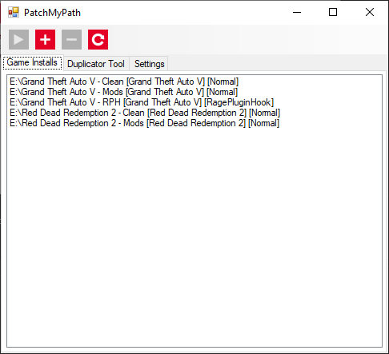

# PatchMyPath <small>for Grand Theft Auto V</small>

[![5mods][5mods-img]][5mods-url] [![AppVeyor][appveyor-img]][appveyor-url] [![CodeFactor][codefactor-img]][codefactor-url] [![Discord][discord-img]][discord-url]

PatchMyPath is a little application that allows you to have multiple Grand Theft Auto V installs without losing any hard drive space with duplicate files. Is compatible with all game versions from the day one release to the recent Rockstar Games Launcher update. You can even use [Unknown Modder's](https://www.gta5-mods.com/users/Unknown%20Modder) [Launcher Bypass](https://www.gta5-mods.com/tools/gtavlauncherbypass)!

The following versions have been extensively tested and are guaranteed to work:

* Rockstar Games Launcher
    * 1.0.1737.6

    

[5mods-img]: https://img.shields.io/badge/5mods-download-20BA4E.svg
[5mods-url]: https://www.gta5-mods.com/tools/patchmypath
[appveyor-img]: https://img.shields.io/appveyor/ci/justalemon/patchmypath.svg?label=appveyor
[appveyor-url]: https://ci.appveyor.com/project/justalemon/patchmypath
[codefactor-img]: https://www.codefactor.io/repository/github/justalemon/patchmypath/badge
[codefactor-url]: https://www.codefactor.io/repository/github/justalemon/patchmypath
[discord-img]: https://img.shields.io/badge/discord-join-7289DA.svg
[discord-url]: https://discord.gg/Cf6sspj
[releases-url]: https://github.com/justalemon/PatchMyPath/releases
