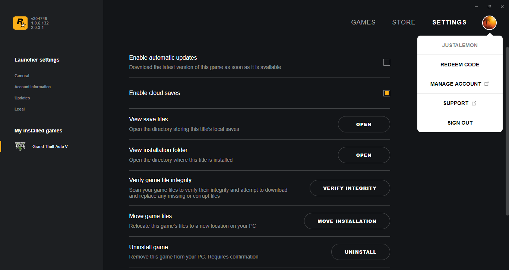
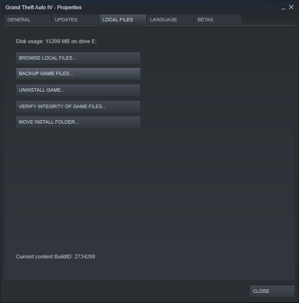

# Using the Install Duplicator

!!! warning
    If you need to move or rename the folder that you specified as `Origin`, you need to repeat the duplication process. Please note that repeating the duplication folder into an existing destination folder will not remove any installed mods.

!!! info
    To create [Symbolic](https://en.wikipedia.org/wiki/Symbolic_link) or [Hard Links](https://en.wikipedia.org/wiki/Hard_link), you need to run the application as administrator (right click the program and select `Run as administrator`) or enable the Windows 10 Developer Mode (`Windows Settings > Update & Security > For developers > Select Developer mode > Click Yes`).

The Install Duplicator is a tool that allows you to use a feature of Windows for linking a file to another folder instad of copying. This makes the linked file work as a normal file while not using any storage space other than the original files. 

Take a look at the following table for some examples about how much storage space you can save with the Install Duplicator:

| Game and Duplicator usage                                | Size                           |
| -------------------------------------------------------- | ------------------------------ |
| Grand Theft Auto V - One Install                         | 85 GB (92,313,329,323 bytes)   |
| Grand Theft Auto V - Two Installs without Duplication    | 171 GB (184,626,658,646 bytes) |
| Grand Theft Auto V - Two Installs with Duplication       | 85 GB (92,388,967,011‬ bytes)   |
| Red Dead Redemption 2 - One Install                      | 112 GB (120,797,290,141 bytes) |
| Red Dead Redemption 2 - Two Installs without Duplication | 224 GB (241,594,580,282‬ bytes) |
| Red Dead Redemption 2 - Two Installs with Duplication    | 112 GB (120,886,667,053 bytes) |

To use the Install Duplicator, you need a working Grand Theft Auto V or Red Dead Redemption 2 install for the new copy. Please note that is not recommended using an existing modded/dirty install to be used as a base.

??? tip "Click here for instructions that allow you to check the Integrity of the game"
    * Rockstar Games Launcher: Go to `Settings > My installed games > Grand Theft Auto V` and click `Verify Integrity` to ensure that all of the files are on their vanilla state

    

    * Steam: Right Click the game and select `Properties`. Then, go to the `Local Files` tab and click `Verify Integrity of Local Files...`

    

Using the Install Duplicator is pretty easy, you need to:

* Select the game type (Red Dead Redemption 2 or Grand Theft Auto V)
* Choose the game folder that is going to be used as the source
* Pick the Destination for the game folder
* Click `Duplicate Game Folder`
