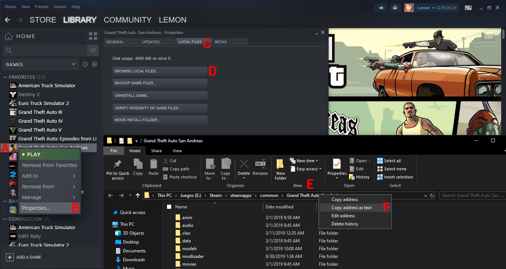
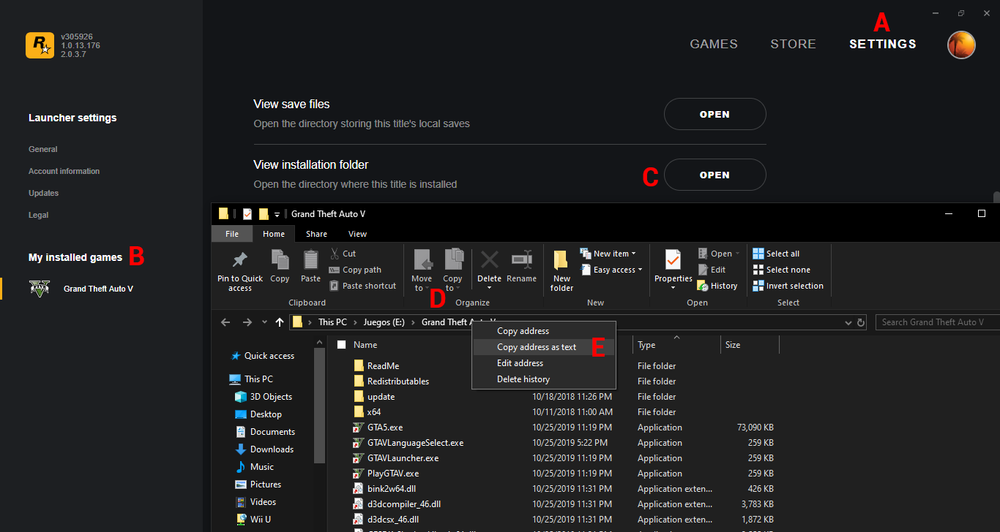

# Getting started

!!! tip
    If you need support or want some questions answered [join the Discord server](https://discord.gg/Cf6sspj).

!!! warning
    PatchMyPath does not supports pirate copies of Red Dead Redemption 2 and Grand Theft Auto V.

## Installation

Before installing PatchMyPath, make sure that [.NET Framework 4.5.2](https://dotnet.microsoft.com/download/dotnet-framework/net452) is installed on your computer.

1. Download the compressed file from [GitHub][releases-url], [5mods][5mods-url] or [Nexus Mods][nexus-url]
2. Extracts the contents of the compressed file somewhere on your PC
3. Launch `PatchMyPath.exe` and select the `Settings` tab
4. Click the respective `Detect` buttons for the game that you plan to use
    * If the button was unable to detect your game original location, you can enter the game location manually

    ??? tip "Click here for Steam instructions"
        

        1. Right click the game that you want to get the location from
        2. At the bottom of the menu, click `Properties...`
        3. Select the `Local Files` tab
        4. Click the `Browse Local Files...` button
        5. On Windows Explorer, right click the address bar at the top
        6. Select `Copy address as text` and paste it on the PatchMyPath Location field

    ??? tip "Click here for Rockstar Games Launcher instructions"
        

        1. At the top left of the application, click `Settings`
        2. Select the game that you want to get the location from in `My installed games`
        3. On `View installation folder`, click `Open`
        4. On Windows Explorer, right click the address bar at the top
        5. Select `Copy address as text` and paste it on the PatchMyPath Location field

5. Click `Save` to store the original location of the game
6. If this is the orignal folder of the game, you will be asked to rename it to prevent future problems, click `Yes`
7. Optional: Use the [Install Duplicator](getting-started.md) to reduce the size of your existing installs or create new ones

## Usage

First, you need to add your game installs by pressing . Then, select the RDR 2 or GTA V folder and press `OK`.

!!! info
    If you want to use RedHook2 or ScriptHook with RDR 2, you need to create a folder called RedHook2 or ScriptHook respectively and place all of the files in there.

To launch the install, select it on the list and press . Please note that games with executables tampered can't be launched.

If you want to remove an install from the list, select it and press . You will be asked if you also want to remove it from the hard drive.

To refresh the list of installs and check again if they are valid, press .

[releases-url]: https://github.com/justalemon/PatchMyPath/releases
[5mods-url]: https://www.gta5-mods.com/tools/patchmypath
[nexus-url]: https://www.nexusmods.com/reddeadredemption2/mods/61
