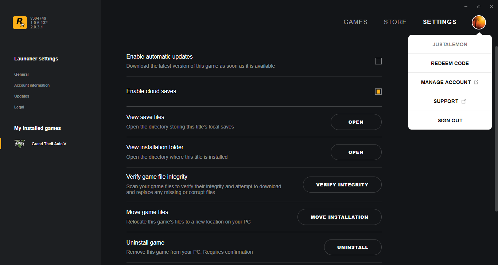
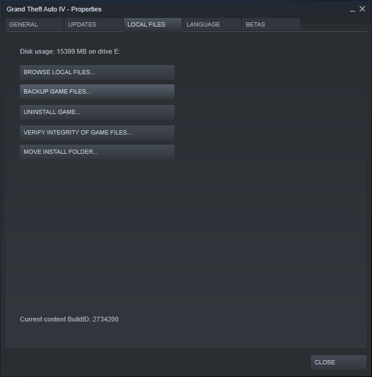
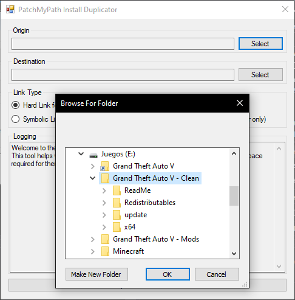
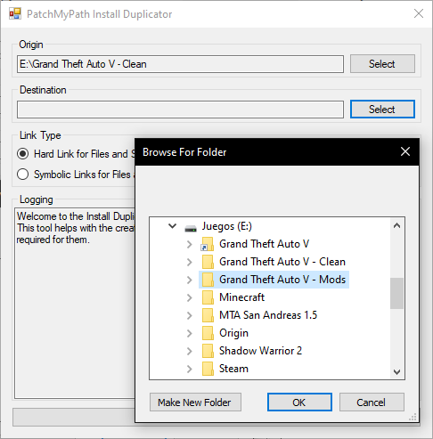
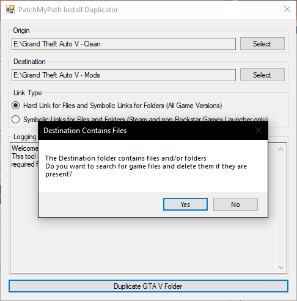
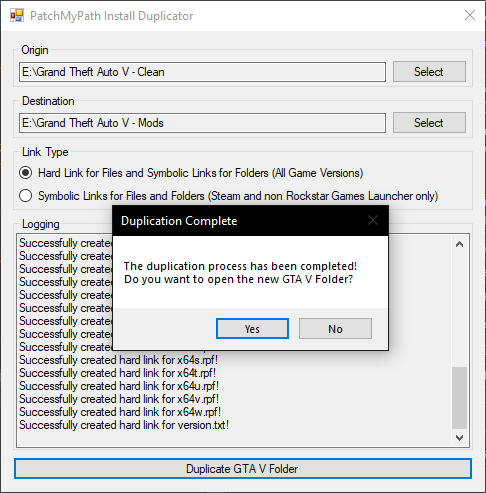

# Duplicating Vanilla Installs

## Before we Start

* After moving/renaming the vanilla GTA V folder, **don't** do it again. If you do it, the symbolic and hard links are going to break permanently and you might need to do this entire process from the start
* You need to run the application as an administrator or enable the developer mode, this is a limitation by Windows that prevent us from creating the symbolic links

## About this Process

PatchMyPath provides a tool called Install Duplicator. As the name says, it duplicates a Grand Theft Auto V install for the use on PatchMyPath without losing space on duplicated files (remember that the size of a vanilla GTA V install is 85.9 GB).

## Cleaning an Install

First, you need a working Grand Theft Auto V install for the new copy that is going to be created. You can use an existing modified copy, but we recommend that you start with a Vanilla install and use a dupe for modding.

??? example "Click/Tap here for a list of Vanilla Files"
    Please note that the files marked are optional are not required for Grand Theft Auto V to run, but they might be required for other functions like Grand Theft Auto Online and the installation wizard.

    **Folders**

    * ReadMe (optional)
    * Redistributables (optional)
    * update
    * x64

    **Files**

    * GTA5.exe
    * GTAVLanguageSelect.exe (optional)
    * GTAVLauncher.exe
    * PlayGTAV.exe (optional)
    * bink2w64.dll
    * d3dcompiler_46.dll
    * d3dcsx_46.dll
    * GFSDK_ShadowLib.win64.dll
    * GFSDK_TXAA.win64.dll
    * GFSDK_TXAA_AlphaResolve.win64.dll
    * GPUPerfAPIDX11-x64.dll
    * NvPmApi.Core.win64.dll
    * index.bin (optional)
    * common.rpf
    * x64a.rpf
    * x64b.rpf
    * x64c.rpf
    * x64d.rpf
    * x64e.rpf
    * x64f.rpf
    * x64g.rpf
    * x64h.rpf
    * x64i.rpf
    * x64j.rpf
    * x64k.rpf
    * x64l.rpf
    * x64m.rpf
    * x64n.rpf
    * x64o.rpf
    * x64p.rpf
    * x64q.rpf
    * x64r.rpf
    * x64s.rpf
    * x64t.rpf
    * x64u.rpf
    * x64v.rpf
    * x64w.rpf
    * version.txt (optional)

If you are not sure if your game install is intact, you can go to `Settings > My installed games > Grand Theft Auto V` and click `Verify Integrity` to ensure that all of the files are on their vanilla state. For Steam, please visit this [Knowledge Base Article](https://support.steampowered.com/kb_article.php?ref=2037-QEUH-3335).

## Moving/Renaming the original folder

We are going to start changing game files. Please, close the Rockstar Games Launcher, and if you have a Steam copy, also close Steam.

First, you need to move or rename your existing vanilla Grand Theft Auto V folder. If you don't do this, you won't be able to change folders with PatchMyPath.

Let's say that your existing Grand Theft Auto V install is located on `C:\Program Files\Grand Theft Auto V`, you can:

* Rename it (for example, `C:\Program Files\Grand Theft Auto V - Clean`)
* Move it (for example, `E:\Grand Theft Auto V - Clean`)

Please remember the original location of the game. We are going to need the original install location for PatchMyPath.

## Using the Install Duplicator

We are now ready to duplicate an existing game install. Go ahead and open `InstallDuplicator.exe`, you should see this window.

To select the Vanilla folder, click the `Select` button near `Origin`. Then, navigate to the folder that we renamed or moved on the previous step.

Then, repeat the same process but with the second `Select` button near `Destination` to pick where the duplicated copy should be saved.

After that, just click `Duplicate GTA V Folder`. If the directory that you selected contains files or folders, you will be asked if you want to check for game files and remove them if they are present. If you choose no, the duplication process will be stopped.

!!! info "About the removal of files"
    Please note that the option to remove files will not delete any mods or scripts installed, only game files that will be linked against the original install to save storage.

If you get the following message, congratulations! The entire duplication process has been completed. You will be asked if you want to open the folder on the Windows File Explorer, and that is up to you.

